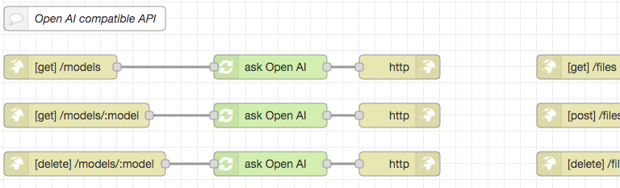
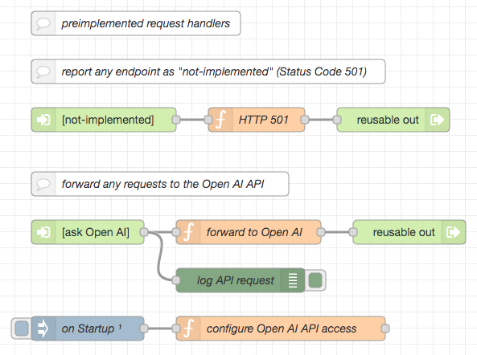

# node-red-openai-api #

a replication of the Open AI API for Node-RED

This repository contains flows for [Node-RED](https://nodered.org/) which replicate the [Open AI API](https://platform.openai.com/docs/api-reference/introduction). This allows users to route requests to Open AI products through their own (or a hosted) Node-RED server, giving them full control over all requests.

Possible use cases could be:

* log any requests to the Open AI - either for reporting reasons or just to learn how other scripts (like [Auto-GPT](https://github.com/Significant-Gravitas/Auto-GPT) or [BabyAGI](https://github.com/yoheinakajima/babyagi)) use this API to reach their goals (see [Recipes section](#recipes) for concrete instructions how to use this proxy in such scripts);
* don't give your (secret!) Open AI API key to potentially dangerous scripts! Instead, add it to these flows only and configure your untrusted scripts to use these endpoints as a proxy;
* replace some (or all) requests to the Open AI API by your own implementations - e.g., based on other flows which use [LLaMA](https://github.com/rozek/node-red-flow-llama), [Stanford Alpaca](https://github.com/rozek/node-red-flow-alpaca), or GPT4All [filtered](https://github.com/rozek/node-red-flow-gpt4all-filtered) or [unfiltered](https://github.com/rozek/node-red-flow-gpt4all-unfiltered) or [GPT4All-J](https://github.com/rozek/node-red-flow-gpt4all-j) models.

In any case, this proxy gives you much more control over Open AI API requests with respect to

* data privacy,
* safety and
* costs.



> Just a small note: if you like this work and plan to use it, consider "starring" this repository (you will find the "Star" button on the top right of this page), so that I know which of my repositories to take most care of.

## Installation ##

To install these flows, simply open the Flow Editor of your Node-RED server and import the contents of file [OpenAI-API.json](./OpenAI-API.json) - best into a new workspace.

### Note for Users of "node-red-within-express" ###

These flows are fully compatible with [node-red-within-express](https://github.com/rozek/node-red-within-express). However, please remember that you will have to prepend the URLs of the flow's endpoints by the name of a virtual host, if you run the express server described there in the mode with virtual hosts processing:

To give an example: change the URL of endpoint _[get] /models_ to `/.../models` and replace the ellipsis `...` by the name of the virtual host which should serve that endpoint.

## Usage ##

By default, any incoming request is logged into the Node-RED Flow Editor's debug pane and simply passed to the original Open AI API - this is done by a [reusable flow](https://github.com/rozek/node-red-contrib-reusable-flows) node called "ask Open AI".



If you like, you may edit the function node "configure Open AI API access" and enter your Open AI API key, if need be, together with your Open AI Organization - if set, these settings will overwrite related headers in incoming HTTP requests.

However, if you prefer, you may also replace the default behaviour of any HTTP endpoint - either by using "not-implemented" or by a node of your own.

## Configuring Python Scripts to use these Flows ##

Nowadays, many AI tools and scripts are written in Python. These scripts usually import the [OpenAI Python Library](https://github.com/openai/openai-python) and define the Open AI API key in a line that should look like

```
openai.api_key = ...
```

where the ellipsis (`...`) denotes the actual API key. Sometimes this key is read from an environment variable, sometimes you have to enter it yourself - but that's irrelevant.

Just look for any occurance of `openai.api_key` in any script of your AI tool and

* (if you want to hide your API key from the AI tool) replace the API key by something else (if you had to enter the key directly - otherwise make that change whereever required, e.g., in a configuration file (sometimes called `.env`), an environment variable, a configuration form etc.)
* add another line looking like<br>&nbsp;<br>`openai.api_base = "..."`<br>&nbsp;<br>where you replace the ellipsis (`...`) by the URL of your Node-RED server (without the actual HTTP endpoint paths `/models`, `/models/:model`, etc.)<br>&nbsp;<br>**Important: use the same indentation as in the line before (e.g., the one starting with `openai.api_key`) as proper indentation is relevant for Python scripts)**

## Credits ##

The Node-RED HTTP entry points are based on the [Open AI API documentation](https://platform.openai.com/docs/introduction) and an [OpenAPI specification for the Open AI API](https://github.com/openai/openai-openapi) (please use the [author's fork of that specification](https://github.com/rozek/openai-openapi) if you plan to create other clients from it as that fork contains updated installation instructions)

## License ##

[MIT License](LICENSE.md)
