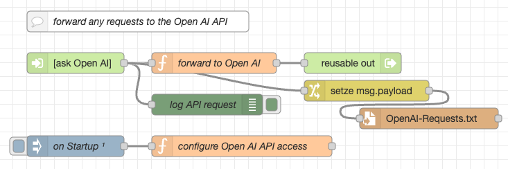

# node-red-openai-api #

a replication of the Open AI API for Node-RED

This repository contains flows for [Node-RED](https://nodered.org/) which replicate the [Open AI API](https://platform.openai.com/docs/api-reference/introduction). This allows users to route requests to Open AI products through their own (or a hosted) Node-RED server, giving them full control over all requests.

Possible use cases could be:

* log any requests to the Open AI API - either for reporting reasons or just to learn how other scripts (like [Auto-GPT](https://github.com/Significant-Gravitas/Auto-GPT) or [BabyAGI](https://github.com/yoheinakajima/babyagi)) use this API to reach their goals (see [Recipes section](#recipes) for concrete instructions how to use this proxy in such scripts);
* don't give your (secret!) Open AI API key to potentially dangerous scripts! Instead, add it to these flows only and configure your untrusted scripts to use these endpoints as a proxy;
* replace some (or all) requests to the Open AI API by your own implementations - e.g., based on other flows which use [LLaMA](https://github.com/rozek/node-red-flow-llama), [Stanford Alpaca](https://github.com/rozek/node-red-flow-alpaca), or GPT4All [filtered](https://github.com/rozek/node-red-flow-gpt4all-filtered) or [unfiltered](https://github.com/rozek/node-red-flow-gpt4all-unfiltered) or [GPT4All-J](https://github.com/rozek/node-red-flow-gpt4all-j) models.

In any case, this proxy gives you much more control over Open AI API requests with respect to

* data privacy,
* safety and
* costs.


> Just a small note: if you like this work and plan to use it, consider "starring" this repository (you will find the "Star" button on the top right of this page), so that I know which of my repositories to take most care of.

## Installation ##

If not already done before, [install "reusable flows"](https://github.com/rozek/node-red-contrib-reusable-flows#installation) into your Node-RED server.

Then, to install the flows from this repository, simply open the Flow Editor of your Node-RED server and import the contents of file [OpenAI-API.json](./OpenAI-API.json) - best into a new workspace.

### Note for Users of "node-red-within-express" ###

These flows are fully compatible with [node-red-within-express](https://github.com/rozek/node-red-within-express). However, please remember that you will have to prepend the URLs of the flow's endpoints by the name of a virtual host, if you run the express server described there in the mode with virtual hosts processing:

To give an example: change the URL of endpoint "_[get] /models_" to `/.../models` and replace the ellipsis `...` by the name of the virtual host which should serve that endpoint.

## Usage ##

By default, any incoming request is logged into the Node-RED Flow Editor's debug pane and simply passed to the original Open AI API - this is done by a [reusable flow](https://github.com/rozek/node-red-contrib-reusable-flows) node called "ask Open AI".


If you like, you may edit the function node "configure Open AI API access" and enter your Open AI API key, if need be, together with your Open AI Organization - if set, these settings will overwrite related headers in incoming HTTP requests.

However, if you prefer, you may also replace the default behaviour of any HTTP endpoint - either by using "not-implemented" or by a node of your own.

### Logging into a File ###

If you prefer to log requests into a file, then just import the contents of file [FileLogging.json](./FileLogging.json) and wire it as shown below:



Any requests will then be written to file `OpenAI-Requests.txt` in the installation folder of your Node-RED server - in a format that is close to JSON: if you really want to treat its contents as JSON input, just

* prepend an opening bracket `[`,
* remove the last character (its a comma `,`) and
* append a closing bracket `]` instead.

## Configuring Python Scripts to use these Flows ##

Nowadays, many AI tools and scripts are written in Python. These scripts usually import the [OpenAI Python Library](https://github.com/openai/openai-python) and define the Open AI API key in a line that should look like

```
openai.api_key = ...
```

where the ellipsis (`...`) denotes the actual API key. Sometimes this key is read from an environment variable, sometimes you have to enter it yourself - but that's irrelevant.

Just look for any occurance of `openai.api_key` in any script of your AI tool and

* (if you want to hide your API key from the AI tool) replace the API key by something else (if you had to enter the key directly - otherwise make that change whereever required, e.g., in a configuration file (sometimes called `.env`), an environment variable, a configuration form etc.)
* add another line looking like<br>&nbsp;<br>`openai.api_base = "..."`<br>&nbsp;<br>where you replace the ellipsis (`...`) by the URL of your Node-RED server (without the actual HTTP endpoint paths `/models`, `/models/:model`, etc.)<br>&nbsp;<br>**Important: use the same indentation as in the line before (e.g., the one starting with `openai.api_key`) as proper indentation is relevant for Python scripts)**

## Recipes ##

This section contains concrete instructions how to modify a (hopefully growing) list of AI tools such that they use this Open AI API proxy.

### Preconditions ###

Redirecting requests to your own server nowadays requires the use of HTTPS rather than HTTP. HTTPS is based on "Transport Layer Security" (TLS) and one of its security measures is to require servers to identify themselves using a certificate. Normally, such a certificate has to be "issued" and "signed" by a well-known "Certificate Authority" (CA) - [Lets Encrypt](https://letsencrypt.org) is such a well-known CA.

If your Node-RED server can be accessed from the public internet, just request a certificate from Lets Encrypt, install it in your server and you're fine.

However, if your server is a local one, Lets Encrypt cannot prove that server's identity and won't issue any certificate for it. Formerly, you would just have created a "self-signed certificate" and ignored any warnings thrown at you by your browsers and tools like `curl` - but that's no longer possible.

As a consequence you now have to

* create your own local "Certificate Authority"
* create a certificate for your server which is then signed by your local CA and
* install the certificate for your local CA in any system from which you plan to send requests to your server - this makes your CA as well-known as the global ones

Fortunately, this approach is not too difficult but avoids many problems where some script crashes somehow and it turns out to be difficult to find the underlying cause.

Simply follow [this wonderful recipe](https://deliciousbrains.com/ssl-certificate-authority-for-local-https-development/).

### Auto-GPT ###

[Auto-GPT](https://github.com/Significant-Gravitas/Auto-GPT) is perhaps the most famous of the currently emerging "autonomous agents". Modifying its script is not too difficult, but requires to touch several files...

If you plan to run Auto-GPT within a [Docker](https://www.docker.com/) container (and you should definitely do so), apply the following changes (depending on whether your server's certificate is an officially signed or a locally signed one):

* with an officially signed certificate
  * edit file `.env`<br>insert the following line at the beginning of this file:<br>&nbsp;<br>&nbsp; `OPENAI_API_BASE=https://host-name:port`<br>&nbsp;<br>Important:
    * replace "host-name" with the name of your server (the same you used when requesting its certificate)
    * if your server listens to a non-standard port, append ":" and the port number after the host name
    * **very important**: do not end the API base setting with a slash - it won't work!
* with a locally signed certificate
  * edit file `docker-compose.yaml`<br>find section `services:` > `auto-gpt` and append the following two lines<br>&nbsp;<br>&nbsp; `extra_hosts:`<br>&nbsp; `- "host-name:ip-address"`<br>&nbsp;<br>Important:
    * replace "host-name" with the name of your server (the same you used when creating its certificate)
    * replace "ip-address" with that server's local IP address
    * when adding these two lines, make sure that they have the same indentation as the line above, as proper indentation is relevant for YAML
  * edit file `Dockerfile`<br>after line `FROM python:3.10-slim` append the following lines<br>&nbsp;<br>&nbsp; `ADD localCA.pem /usr/local/share/ca-certificates/localCA.crt`<br>&nbsp; `RUN chmod 644 /usr/local/share/ca-certificates/localCA.crt && update-ca-certificates`<br>&nbsp; `RUN export SSL_CERT_FILE=/etc/ssl/certs/ca-certificates.crt`<br>&nbsp; `RUN export REQUESTS_CA_BUNDLE=/etc/ssl/certs/ca-certificates.crt`<br>&nbsp;<br>Important:
    * the first of these lines assumes, that you copied the certificate for your local CA into the root folder of the Auto-GPT repository and named that copy "localCA.pem"
  * edit file `.env`<br>insert the following lines at the beginning of this file:<br>&nbsp;<br>&nbsp; `OPENAI_API_BASE=https://host-name:port`<br>&nbsp; `SSL_CERT_FILE=/etc/ssl/certs/ca-certificates.crt`<br>&nbsp; `REQUESTS_CA_BUNDLE=/etc/ssl/certs/ca-certificates.crt`<br>&nbsp;<br>Important:
    * replace "host-name" with the name of your server (the same you used when creating its certificate)
    * if your server listens to a non-standard port, append ":" and the port number after the host name
    * **very important**: do not end the API base setting with a slash - it won't work!

### BabyAGI ###

(pending)

## Credits ##

The Node-RED HTTP entry points are based on the [Open AI API documentation](https://platform.openai.com/docs/introduction) and an [OpenAPI specification for the Open AI API](https://github.com/openai/openai-openapi) (please use the [author's fork of that specification](https://github.com/rozek/openai-openapi) if you plan to create other clients from it as that fork contains updated installation instructions)

## License ##

[MIT License](LICENSE.md)
